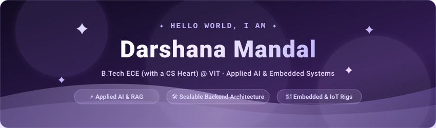
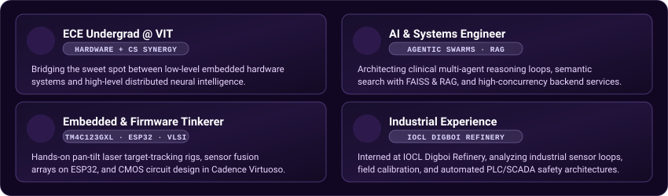
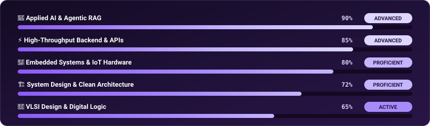
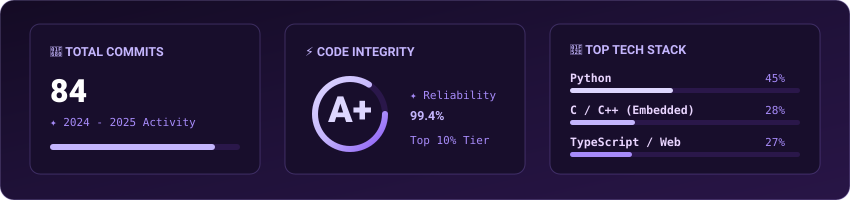
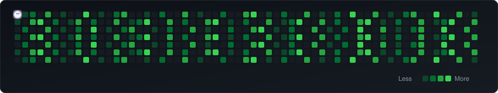

<div align="center">

<!-- ═══════════════════════════ HEADER BANNER ═══════════════════════════ -->


<br>

<!-- Dynamic Typing Headline (Pastel Purple) -->


<br><br>

<!-- Social Links (Large Pastel Purple Badges) -->
<a href="mailto:dishu6243@gmail.com" target="_blank">
  
</a>
&nbsp;
<a href="https://www.linkedin.com/in/darshana-mandal" target="_blank">
  
</a>
&nbsp;
<a href="https://github.com/DarshanaMandal" target="_blank">
  
</a>

<br><br>

<!-- Profile Views & Followers (Pastel Lavender) -->

&nbsp;


<br><br>

<!-- Animated Loading Widget -->


</div>

<br>


<br>

## 🔮 `>_` About Me

<div align="center">

```json
{
  "name": "Darshana Mandal",
  "education": "B.Tech in Electronics & Communication Engineering (with a CS Heart) @ VIT | 2023 – 2027",
  "focus_areas": [
    "Applied AI, Multi-Agent Systems & Vector Search (RAG)",
    "High-Concurrency Backend Architecture & API Design",
    "Embedded C Firmware, IoT Telemetry & VLSI / Digital Logic"
  ],
  "current_role": "Electrical & Instrumentation Intern @ IOCL Digboi Refinery",
  "past_research": "Digital System Design Intern @ NIT Durgapur (CMOS & VLSI)",
  "philosophy": "Clean architecture, thoughtful hardware-software synergy, and code crafted to scale.",
  "location": "Vellore / Assam, India",
  "contact": "dishu6243@gmail.com"
}
```

</div>

<br>

<!-- Quick Overview (Pastel Purple 4-Card UI) -->



<br>


<br>

## ⚡ Tech Arsenal

<div align="center">

### 💻 Languages & Core
<p align="center">
  
  
  
  
  
  
</p>

### 🧠 Applied AI, ML & Data Science
<p align="center">
  
  
  
  
  
  
  
</p>

### 🌐 Backend, Web & Mobile
<p align="center">
  
  
  
  
  
  
</p>

### 🗄️ Databases & Infrastructure
<p align="center">
  
  
  
  
  
  
</p>

### 🔌 Embedded, Hardware & Engineering Tools
<p align="center">
  
  
  
  
  
  
  
</p>

</div>

<br>


<br>

## 📈 Skill Proficiency & Focus

<div align="center">
  
</div>

<br>


<br>

## 🏆 Milestones & Experience

<table width="100%">
  <thead>
    <tr align="left">
      <th width="8%" align="center">Badge</th>
      <th width="35%">Organization / Experience</th>
      <th width="57%">Key Role, Research & Scope</th>
    </tr>
  </thead>
  <tbody>
    <tr>
      <td align="center">🛢️</td>
      <td><strong>IOCL Digboi Refinery</strong><br><sub><em>Electrical &amp; Instrumentation Intern</em></sub></td>
      <td>Industrial sensor calibration loops, field transmitters, and PLC/SCADA automated safety architectures in refinery operations.</td>
    </tr>
    <tr>
      <td align="center">🔬</td>
      <td><strong>NIT Durgapur</strong><br><sub><em>Digital System Design Intern</em></sub></td>
      <td>CMOS analog/digital circuit analysis, VLSI schematic synthesis, and timing closure simulations in <strong>Cadence Virtuoso</strong>.</td>
    </tr>
    <tr>
      <td align="center">✈️</td>
      <td><strong>Team Aviators</strong><br><sub><em>Technical Subsystem Engineer</em></sub></td>
      <td>UAV flight avionics architecture, payload telemetry sensor fusion &amp; real-time microcontroller integration.</td>
    </tr>
    <tr>
      <td align="center">📊</td>
      <td><strong>Business Analytics &amp; EDA</strong><br><sub><em>Statistical Modeling</em></sub></td>
      <td>Exploratory data analysis, statistical forecasting, Excel modeling, and interactive reporting dashboards in Power BI.</td>
    </tr>
    <tr>
      <td align="center">💼</td>
      <td><strong>Strategic Case Frameworks</strong><br><sub><em>Management Consulting</em></sub></td>
      <td>Structured analytical problem solving, market sizing, hypothesis testing &amp; business case interview frameworks.</td>
    </tr>
  </tbody>
</table>

<br>


<br>

## 📊 GitHub Telemetry

<div align="center">

<!-- Custom Pastel Telemetry Card -->


<br><br>

<!-- Streak Stats Card (Pastel Purple) -->


</div>

<br>


<br>

## 🐍 Contribution Stream

<div align="center">
  <!-- Light Purple Eating Snake Animation on GitHub Contribution Grid -->
  
</div>

<br>


<br>

<!-- ═══════════════════════════ LET'S CONNECT & FOOTER ═══════════════════════════ -->
<div align="center">


<br><br>

## 💜 Let's Connect & Collaborate!

<p align="center">
  <i>"Always open to discussing high-scale backend architectures, Agentic AI research, embedded hardware, or new opportunities."</i>
</p>

<br>

<a href="mailto:dishu6243@gmail.com">
  
</a>
&nbsp;
<a href="https://www.linkedin.com/in/darshana-mandal" target="_blank">
  
</a>
&nbsp;
<a href="https://github.com/DarshanaMandal" target="_blank">
  
</a>

<br><br><br>


</div>
